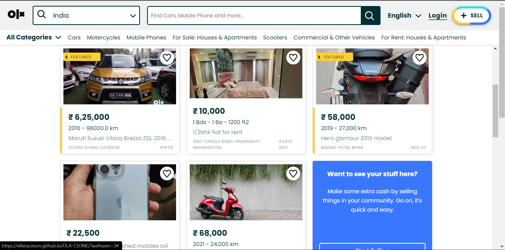

# OLX-Clone

## Overview
Welcome to the OLX Clone project! This project aims to replicate the UI of OLX. Whether you're a developer looking to contribute or a user wanting to set up your own local classifieds platform, you're in the right place.

## Features
- **User-Friendly Design:** Our design language is easy and eye-pleasing to use.
- **Responsive Design:** The frontend is designed to be responsive, ensuring a consistent and enjoyable experience across various devices.

## Technologies Used
- **HTML5/CSS3:** For structuring and styling the web pages.
  
## Pages and Links
- **Hosted Link:** [https://elixirpoison.github.io/OLA-CLONE/]
- **Home**

## Website Images

## Acknowledgments
- This project draws inspiration from the design of OLX.
- Thankful to our teachers.

